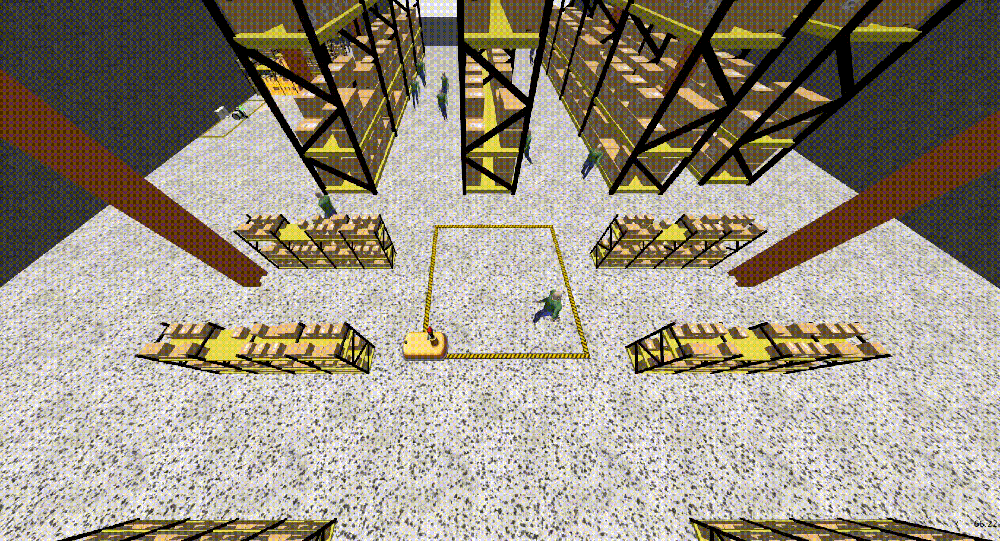
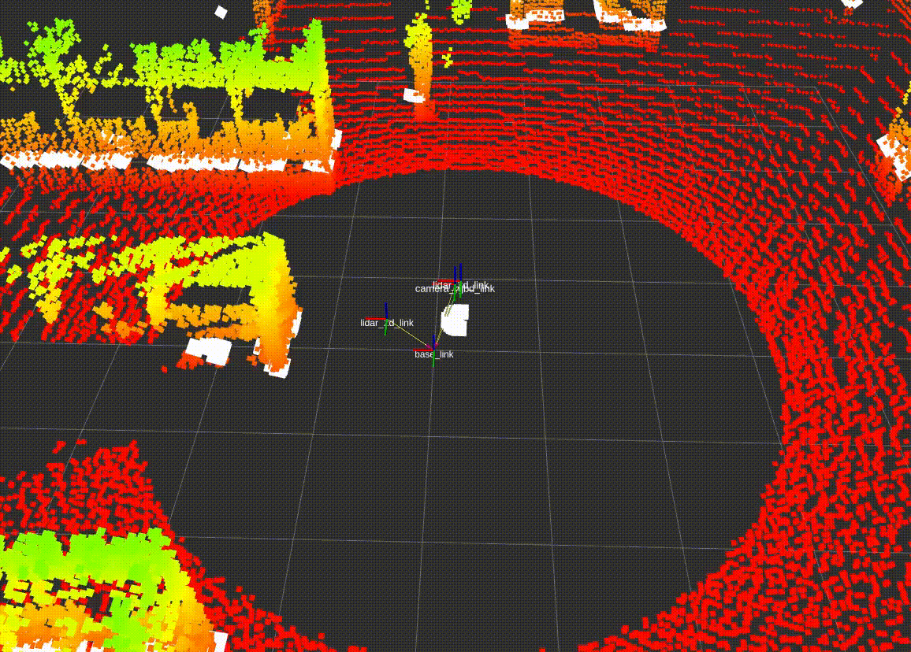

# Warehouse Simulation with Gazebo Fortress

This repository provides an industrial warehouse simulation using Gazebo Fortress on Ubuntu 22.04, built to integrate and communicate with ROS 2 Humble. It is fully containerized with Docker to ensure quick setup, reproducible environments, and consistent runs across machines. The package includes world configurations, models, and launch scripts so you can start the simulation with a single command.

<p align="center">
  
  <br>
  <em>Gazebo Simulation</em>
</p>

<p align="center">
  
  <br>
  <em>RViz Visualization</em>
</p>


## Installation

This package has been designed and tested on an x86_64 machine under the Ubuntu 22.04 (Jammy Jellyfish) operating system and ROS2 Humble distribution.

For installation, execute the script availible in:

```
warehouse_simulator/scripts/env_setup.sh
```

## Starting

Steps to start the robot simulation in the warehouse with ROS2

Note: Run all commands from a new terminal, and make sure you are in the root directory of your project.


### Step 1: Create your workspace


```
mkdir -p ~/warehouse_ws/src
```
```
cd ~/warehouse_ws/
```
```
colcon build
```

### Step 2: Launch the simulation

This is the final command. It starts Gazebo, loads the warehouse world, spawns the RB_Theron robot, and activates the control system.

```
ros2 launch warehouse_simulator warehouse_simulation.launch.py
```
